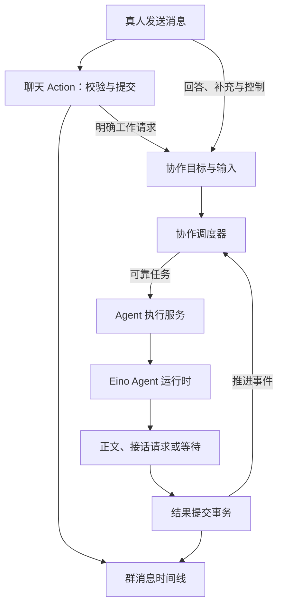
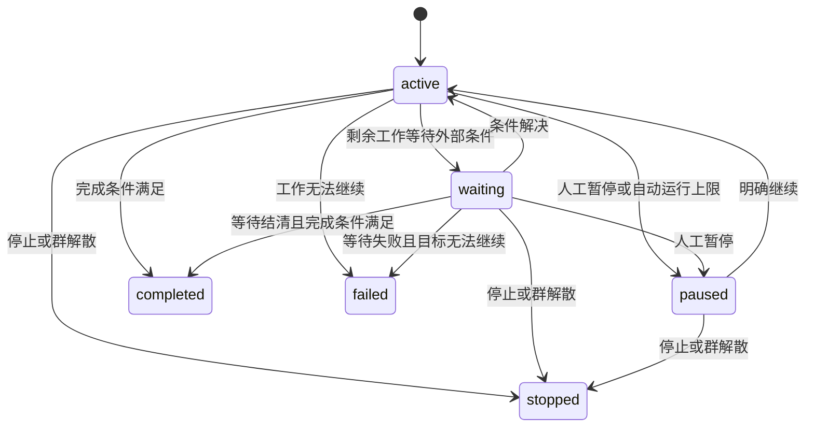

# Cervi 群内 Agent 协作设计

日期：2026-09-09。本文定义群内真人与 Agent 协作的完整目标架构、产品行为和实现契约。

## 1. 架构总览

### 1.1 三个明确的范围

Cervi 通过群承载交流，通过协作组织工作，通过 Agent 执行完成具体请求。

| 范围 | 负责什么 | 例子 |
| --- | --- | --- |
| 群 Conversation | 成员、消息、引用、提醒、阅读状态 | 产品研发群 |
| 协作 Collaboration | 一项工作的目标、参与者、进展和结果 | 评审支付方案 |
| Agent 执行 AgentRun | 某位 Agent 处理具体输入的一次工作 | 技术助手分析支付接口 |

用户发送“下午三点开会”，消息进入群时间线。用户发送“@助理 整理会议材料”，系统自动建立一项协作，把工作交给助理。用户发起“请产品、技术和财务讨论支付方案”，系统建立一项具有多位参与者的协作，按所选策略安排发言。

每项协作独立管理目标、输入、等待和控制。同一个群可以同时开展多项协作，同一个 Agent 可以同时参与不同协作。真人在这些工作进行期间照常聊天。

### 1.2 职责分工

| 能力 | 实现职责 |
| --- | --- |
| 聊天 Action | 校验群资格，保存消息、提及与引用，维护阅读状态，登记明确的工作请求 |
| 协作调度器 | 根据已接受输入和执行结果，决定谁执行、如何汇合、何时等待与结束 |
| Agent 执行服务 | 认领输入，检查执行授权，调用运行时，提交结果与后续请求 |
| Eino Agent 运行时 | 使用 ChatModelAgent、TurnLoop 和工具完成推理，在安全点吸收补充输入 |
| 可靠任务 | 使用 PostgreSQL、Outbox、NATS 和 Worker 交付后台工作，管理租约与重试 |
| 实时与 Query | 通知状态变化，按当前身份读取已提交消息、协作与执行状态 |



消息写入、协作输入登记和后台唤醒在同一个业务事务中提交。模型与工具调用在事务外执行。各端通过现有 appservice 契约使用这些能力。

### 1.3 稳定的扩展边界

参与者身份、消息关系、协作归属、执行输入、上下文和控制语义组成稳定契约。讨论方式通过 Scheduler 扩展，执行方式通过 Runtime 扩展，工具与设备通过 CapabilityExecutor 扩展，知识和记忆通过授权数据源扩展。

这些扩展遵循同一套参与资格、结果协议与提交规则。产品行为由明确策略配置，业务状态由 PostgreSQL 保存。

## 2. 产品行为

### 2.1 普通聊天与单次委托

普通消息由聊天 Action 完成发送，进入群时间线并维护引用、提及、阅读和通知关系。

用户在普通输入区 @ 一位 Agent 时，系统根据消息自动创建 request 类型协作。根消息提供目标与材料，用户直接发送即可完成委托。Agent 使用自己的身份回复。

同一条消息 @ 多位 Agent 时，系统创建一项包含这些执行者的委托。默认基于同一份公共上下文分别回答，用户也可以选择按指定顺序处理。

委托的参与范围为用户选定的 Agent，默认能力为完成请求和向真人澄清。用户通过“转为讨论”更新目标、参与范围和接话策略。

### 2.2 多 Agent 讨论

用户选择“发起讨论”，填写目标、开场 Agent、参与范围和调度方式。默认参与范围为发起时群内的有效 Agent，开场名单决定首先邀请谁发言。

| 调度方式 | 行为 |
| --- | --- |
| 接力 relay | 一次安排一位 Agent；回答提交后，下一位读取前序结果继续处理 |
| 并行 parallel | 一批 Agent 读取共同公共快照独立回答，批次结束后汇合结果 |
| 主持 coordinator | 主持 Agent 提交分工或总结计划，调度器校验并执行计划 |

讨论默认采用接力方式。Agent 可以引用、补充、质疑其他观点，也可以请求参与范围内的其他 Agent 接话。发言者提交结构化行动请求，调度器根据请求与策略安排后续工作。

### 2.3 消息属于哪项工作

输入区显示明确的协作关联：

1. 选中协作后发送，消息归入该协作。
2. 回复协作消息时，输入区自动关联原协作并显示目标名称。
3. 普通输入区直接 @Agent，创建一项新委托。
4. 普通群消息保存在群时间线，按上下文策略供后续执行读取。

用户可以在发送前清除协作关联。服务端按照请求中的协作编号和发送意图校验归属。每条协作消息归属一项工作，可以引用同群其他可见消息。

已完成、已停止或已失败协作的“继续讨论”操作创建关联原协作的新工作，携带原结论和本次补充。暂停中的协作通过“继续”恢复原工作。

### 2.4 提及、引用和请求

| 关系 | 含义 | 数据表达 |
| --- | --- | --- |
| 提及 | 提醒某位群成员关注 | MessageMention |
| 引用 | 指明回应的原文 | reply_to_message_id |
| 行动请求 | 要求指定 Agent 处理具体输入 | AgentInput |

真人显式 @Agent 或通过输入区明确回应 Agent 时，发送意图生成行动请求。Agent 通过结果协议提交接话请求，消息写入器生成对应提及和请求来源。正文中的文字作为内容保存，参与者编号来自结构化字段。

`@所有人` 表达群提醒。委托执行者由明确的 Agent 目标确定。

### 2.5 真人随时参与

| 真人操作 | 执行行为 |
| --- | --- |
| 给当前 Agent 补充要求 | 投递到当前工作范围的输入通道，执行在安全点吸收 |
| 向其他 Agent 提问 | 在该协作登记目标请求，由调度器安排 |
| 给整项协作补充材料 | 更新公共输入，进入下一批共同快照 |
| 回答澄清问题 | 解决等待项，安排提出问题的 Agent 继续 |
| 调整目标或策略 | 更新控制版本，取消尚未提交的执行，按新目标重排剩余输入 |
| 暂停 | 保留剩余输入与已有结果，结束当前执行片段 |
| 继续 | 根据当前资格与剩余工作重新调度 |
| 停止 | 终结该协作的执行、剩余请求与等待，保留已提交消息 |

普通聊天保持各项协作的目标稳定。对指定协作的控制作用于该项工作。

## 3. 领域模型

### 3.1 协作与执行对象

| 对象 | 职责 |
| --- | --- |
| Collaboration | 目标、类型、参与范围、策略快照、生命周期与结论 |
| CollaborationParticipant | 允许参与的主体、群成员代次、职责与参与状态 |
| CollaborationEvent | 已接受命令、公共输入、请求、调度和结果的有序事实 |
| Dispatch | 一次调度批次，保存公共快照、执行名单和汇合状态 |
| AgentLane | 一个工作范围内某个 Agent 的输入顺序与执行并发边界 |
| AgentInput | 投递到 Lane 的类型化输入、来源和处理状态 |
| AgentRun | 消费一批输入的业务执行，保存结果、用量和执行状态 |
| RunContext | 每次认领实际使用的输入、公共快照与配置来源 |
| ExecutionWait | 等待真人回答、审批或外部结果的条件 |
| ToolInvocation | 一次工具逻辑调用的参数、授权、外部动作和结局 |

普通聊天使用现有 Conversation、Participant 和 Message。协作消息通过 nullable collaboration_id 关联具体工作。

### 3.2 执行范围

AgentLane 的唯一业务键为：

```text
organization_id + scope_kind + scope_id + agent_identity_id
```

| scope_kind | scope_id | 范围 |
| --- | --- | --- |
| agent_chat | Conversation ID | 独立 AI 会话 |
| customer_service | ServiceSession ID | 客服处理周期 |
| collaboration | Collaboration ID | 群内委托或讨论 |

同一 Lane 最多拥有一个 queued、running 或 waiting Run。不同 Lane 独立执行。一个协作最多拥有一个活动 Dispatch，一个 Dispatch 可以安排多个 Agent。

范围守卫负责各自的身份资格、控制版本、上下文来源和消息写回规则。群内多个任务由不同 Collaboration 和 Lane 隔离。

### 3.3 参与资格与授权

群 Participant 保存 membership_epoch，重新入群时递增。协作成员绑定 Participant ID 和成员代次，状态为 available、engaged 或 removed。被点名处理工作后进入 engaged；退出群或移出协作后进入 removed。

参与 Agent 可以请求允许范围内的成员。有效真人群成员可以发起、补充、调整和控制协作；群成员管理沿用群主规则。重新入群者通过明确加入操作取得既有协作的新资格。

Agent 启停使用 eligibility_epoch 表达资格变化。后台执行持有组织、scope、Agent 身份、配置 Revision、成员代次、控制版本、Run 执行代次、Task 身份和能力授权。真人命令使用用户认证身份，Agent 使用服务端签发的内部执行上下文。

## 4. 协作调度

### 4.1 策略快照

协作创建时保存完整类型化策略与版本：

| 维度 | 内容 |
| --- | --- |
| mode | request 委托、discussion 讨论 |
| scheduler | 接力、并行或主持及对应参数 |
| participants | 允许参与者、角色与成员代次 |
| handoff | 允许请求的目标与行动种类 |
| context | 历史范围、共享材料和上下文预算 |
| completion | 请求、等待、成果与结论的完成条件 |
| execution | 自动运行上限、并行度、单次时限与工具能力 |
| presentation | 正文、简要过程和详细执行内容的可见范围 |

策略参数具有 schema、版本和校验器。目标、参与范围或执行含义发生变化时递增 control_epoch，关闭当前未提交执行，释放其未处理输入，按新策略安排工作。

自动运行默认上限为 24 次，包含回答、沉默、规划、失败与取消的业务 Run；同一 Run 的 Task 重试沿用已经计入的次数。达到上限时暂停并保留剩余工作，用户继续时明确追加运行次数。并行度默认 4，单 Run 的工具迭代和执行时间由执行策略确定。

### 4.2 调度器接口

```text
Evaluate(CollaborationSnapshot) → SchedulingDecision

SchedulingDecision
  Dispatch { jobs, contextBoundary, joinPolicy }
  Wait     { unresolvedWaitIds }
  Complete { outcome, conclusionMessageIds }
  Pause    { reason }
```

快照包含已接受输入、参与资格、批次结果、等待项、策略和剩余自动运行次数。job 包含目标 Agent、请求来源、任务内容和成果要求。

Evaluate 使用确定性规则。主持模型作为一个独立 Run 生成 CoordinationProposal，领域校验器检查目标资格、任务来源、能力与剩余运行次数，生成合法计划。主持策略交替安排规划批次和工作批次。

### 4.3 批次与并行

Dispatch 保存控制版本、策略版本、公共消息边界、公共内容快照和汇合条件。接力批次安排一位 Agent，并行批次安排多位 Agent。

同批各 Agent 使用相同公共快照，分别加入自己的授权配置与定向输入。回答按真实提交顺序进入群时间线。批次采用 all_settled 汇合，全部 Run 达到成功、失败或取消结局后推进下一批。

一次计划中的所有 Run 在同一事务创建为 queued，并计入自动运行次数。剩余次数足以建立完整计划时提交批次；不足时保存计划事件并暂停。调度器在协作锁内分配执行名额，Run 的 execution_slot_reserved 记录占用，获得名额时同时写执行 Outbox。

完成、取消或进入持久等待时释放执行名额并唤醒调度器。已解决计算等待的 Run 重新取得名额后恢复；Task 重试沿用原名额。同批较晚启动的 Run 继续读取原公共快照。

同批 Agent 的接话请求保存为协作事件，汇合后再投递。某个 Run 等待工具时，同批其他已安排工作照常执行；下一批在当前批次汇合后建立。

### 4.4 输入顺序与结算

输入类型包含 message_request、agent_request、human_answer、context_update、planning_request、tool_result 和 control_update。每条输入保存来源、因果关系、目标、内容与幂等键。

公共材料和跨 Agent 请求先保存为 CollaborationEvent，由调度器按事件与目标幂等投递。真人针对当前执行者的补充直接进入其 Lane。同一事件内的目标顺序作为发送意图保存，接力按事件顺序和目标顺序调度。

Lane 使用连续 input_seq；输入状态为 pending、claimed、settled、closed。一个 Run 可以合并该 Lane 的连续待处理输入，并保留各自来源。settled_seq 表示连续达到 settled 或 closed 的最高序号。

成功与明确失败结算本 Run 的输入；暂停或调整目标释放尚未处理输入；停止和资格撤销关闭受影响输入。RunContext 与协作事件保存每次认领和释放记录。

## 5. 上下文与执行结果

### 5.1 上下文组成

ContextBuilder 为每次执行认领生成：

- Agent 身份、固定指令、配置 Revision 和有效能力。
- 协作目标、职责、策略版本和当前明确请求。
- 公共快照中的群历史、协作消息、材料与结论。
- 本 Run 的定向补充、引用消息和相关等待结果。
- 当前 Agent 获准使用的知识、记忆与工具结果。

根目标、明确请求和必要引用作为必需输入保留，历史按可见范围和上下文预算裁剪。摘要携带来源边界，附件解析结果携带 File ID 与解析版本，知识和记忆携带授权来源。

消息上下文保留发送者编号、姓名、主体类型、消息编号、提及、引用和协作归属。当前 Agent 自己的发言投影为 assistant，真人和其他 Agent 的内容投影为带发送者标识的外部对话内容。私有配置、记忆和工具原文按照执行身份授权。

### 5.2 三种边界

| 边界 | 用途 |
| --- | --- |
| message_seq | 群消息顺序与公共历史上界 |
| event_seq | 协作输入、控制与决策顺序 |
| input_seq | 单 Lane 输入认领和结算顺序 |

Dispatch 固定公共 message_seq 和 event_seq 上界。RunContext 保存实际输入范围、公共快照引用、定向增量、配置版本以及模型可见内容或不可变内容引用。

接力中，后发言者读取前序已提交回答。并行中，同批回答进入下一批公共快照。给 A 的定向补充更新 A 的上下文；公共补充进入下一批；目标调整立即通过控制版本生效。

### 5.3 Runtime 契约

```text
Execute(RunExecutionRequest, InputFeed) → RunExecutionResult
Resume(RunResumeRequest, InputFeed)    → RunExecutionResult

RunExecutionResult
  TurnResult
  Suspended { checkpoint, waits, usage, processBlocks }
```

执行请求携带已授权身份、配置、输入、时限和过程回调。Eino 适配器负责 ChatModelAgent、TurnLoop、工具循环、安全点和中断恢复，输出 Cervi 类型。

运行时选择沿用 AgentRevision 的 execution_mode、schema_version 和配置内容。运行时注册声明支持的输入、安全点、工具与恢复能力，配置保存时完成能力匹配校验。

TurnLoop 在安全点认领已接受补充；认领形成新的 RunContext，候选正文、问题和接话请求共同更新。执行服务在完成事务中再次比较输入边界，存在必须吸收的补充时返回 continue_input，同一 Run 继续处理；授权或控制版本失效时结束为 cancelled。

首次认领冻结 Agent Revision、有效配置和运行时格式版本，重试沿用实际认领快照。执行期限与剩余额度持久保存，补充和重试使用剩余额度，持久等待释放 Worker 并保存剩余执行时间。

### 5.4 回合结果协议

```text
AgentTurnResult
  outcome: reply | no_reply | await_input | coordination
  publicMessage?
  requests: AgentResponseRequest[]
  question?: HumanQuestion
  coordination?: CoordinationProposal
  consumedThroughInputSeq / contextSnapshotId
  usage / processBlocks
```

| outcome | 结果要求 |
| --- | --- |
| reply | 公开正文，可附已获授权的接话请求 |
| no_reply | 成功结算输入，记录本次没有公开贡献 |
| await_input | 公开问题与回答规则，建立真人等待项 |
| coordination | 主持角色提交结构化计划，可附公开总结 |

结果按 outcome 对应 schema 校验。no_reply 的公开正文和后续请求为空，澄清目标须为当前有效真人，规划结果须由具有规划职责的 Run 提交。

模型使用类型化结束工具提交结果，适配器转换为 AgentTurnResult。请求者身份由 Run 确定，目标与能力由服务端校验，消息正文、提及、后续事件和输入结算由共同写入流程提交。

## 6. 等待、工具与控制

### 6.1 两种等待

| 等待方式 | Run 行为 | 恢复方式 |
| --- | --- | --- |
| 业务澄清 | 公开问题后 Run 成功结束，释放 Lane | 真人回答产生 human_answer，建立新 Run |
| 计算等待 | Run 进入 waiting，保存计算状态，释放 Worker 与执行名额 | 审批或外部结果解决后恢复同一 Run |

ExecutionWait 保存等待类型、所属范围、来源 Run、目标主体、回答规则、状态和解决命令编号。状态为 pending、resolved、cancelled；设置期限的等待到期为 expired。

指定的有效真人可以回答；具有协作控制资格的真人可以转交或关闭问题。多个条件依回答规则汇合，每条回答具有幂等键。全部剩余工作依赖等待条件时，协作进入 waiting。

计算检查点先保存为不可变记录，再由事务校验执行资格并绑定 Run 与等待项。恢复任务携带新的 execution_epoch 和 Task 身份，重新校验当前资格，再读取已绑定检查点。检查点包含 Eino、配置与序列化格式版本，活动执行引用的运行时格式在恢复期间保持可用。

### 6.2 工具与外部动作

能力注册表定义名称、输入输出 schema、执行位置、授权要求、副作用、幂等与恢复方式、展示策略。有效能力来自企业开放能力、Agent Revision、协作策略、当前资源资格及设备授权的交集。

工具调用经过 CapabilityExecutor，可由服务端、MCP 或设备适配器执行。ToolInvocation 保存逻辑调用编号、参数快照、能力授权、状态、外部引用和结果。状态为 pending、running、waiting、succeeded、failed、cancelled、unknown。

副作用能力使用由领域适配器确定的 business_action_key，标识执行范围、原始请求和具体动作。处理同一动作的重试与重新规划沿用该标识，读取已确认结果；明确再次执行时分配新动作标识。提供方幂等能力或业务结果查询确认外部结局。

领域适配器按动作标识在业务存储中原子认领执行资格，并持久保存执行中与已确认结果。重复调用关联原动作；在途动作通过结果查询收敛，确认终态后决定后续处理。各 Run 的 ToolInvocation 保留自身调用与原业务动作的关联。

工具结果未知时进入 unknown 并阻塞依赖该动作的工作。停止保留已发生动作的事实，外部结果继续登记到原 Invocation。

### 6.3 暂停、继续与停止

暂停递增 control_epoch，将当前 Dispatch 置为 cancelled，取消未提交 Run，释放未结算输入，保留公开消息和普通澄清等待。绑定已取消 Run 的审批关闭，后续按当前授权重新建立审批。在途外部动作先确认结局，再允许依赖工作继续。

继续从剩余输入、有效参与者与当前策略建立新批次，保留已使用自动运行次数。目标调整采用相同的执行失效与输入释放规则，并保存新目标和策略版本。

因自动运行次数不足而保存的计划记录原调度决定，继续时根据最新输入、资格和策略重新校验与生成有效计划。

停止递增 control_epoch，终结协作，关闭剩余输入、等待和活跃 Run；事务提交后通知进程内执行 context 取消。已经提交的内容作为历史结果保留。

### 6.4 资格变化

退出群或移出协作的事务关闭其相关输入、等待和执行。群解散终结全部活动协作。

Agent 停用事务递增 eligibility_epoch，并通过 Outbox 投递受影响协作的推进任务。旧代次即刻失去结果提交资格，推进任务收敛相关 Run 与批次。重新启用后的工作根据当前资格创建。

### 6.5 协作生命周期



完成条件要求活动批次已汇合、已接受请求已结清、等待项已解决或关闭、策略要求的成果与结论已提交。主持人的完成提议遵循相同检查。

completed 保存 resolved、partial 或 no_action。单 Agent 失败由 Run 表达，调度器依据剩余工作决定协作结局。业务终态保持稳定，重做通过新 Run 或关联新协作表达。

## 7. 持久化与事务契约

### 7.1 目标结构

以下字段描述核心业务契约，组织编号、创建更新时间和关联一致性由各表实现明确维护。

| 表 | 主要字段 |
| --- | --- |
| conversation_participants | 主体、群角色、有效关系、membership_epoch |
| messages | 现有消息字段、nullable collaboration_id |
| agents | 现有配置引用与状态、eligibility_epoch |
| collaborations | conversation_id、root_message_id、parent_collaboration_id、发起主体、mode、goal、status、outcome、policy_version、policy_snapshot、control_epoch、state_version、last_event_seq、run_allowance、allocated_run_count |
| collaboration_participants | collaboration_id、subject_id、participant_id、membership_epoch、role、status |
| collaboration_events | collaboration_id、event_seq、kind、来源、因果事件、command_key、event_key、类型化 payload、结果引用 |
| collaboration_dispatches | collaboration_id、dispatch_seq、control_epoch、policy_version、公共消息与事件边界、shared_context_snapshot、join_policy、status |
| agent_execution_lanes | organization_id、conversation_id、scope_kind、scope_id、agent_identity_id、desired_seq、settled_seq |
| agent_inputs | lane_id、input_seq、来源、request_key、payload、status、claimed_run_id、settlement_reason |
| agent_runs | lane_id、dispatch_id、agent_revision_id、控制与资格快照、execution_epoch、execution_slot_reserved、status、输入范围、context_snapshot_id、checkpoint_id、response_message_id、outcome、usage、error_code、执行期限 |
| agent_run_contexts | run_id、context_version、输入范围、公共快照引用、实际模型输入与配置来源 |
| agent_run_checkpoints | run_id、execution_epoch、运行时与格式版本、不可变计算状态 |
| agent_run_blocks | run_id、position、kind、类型化过程内容 |
| execution_waits | scope_kind、scope_id、run_id、kind、来源、目标、回答规则、status、response、解决命令、期限 |
| tool_invocations | run_id、logical_call_id、business_action_key、能力、参数与授权快照、status、外部引用、结果 |

Dispatch 状态为 active、settled、cancelled。Run 状态为 queued、running、waiting、succeeded、failed、cancelled。运行中各次上下文以不可变快照保存。

协作命令对应唯一 command_accepted 事件，保存规范化意图和结果引用；派生事实使用独立 event_key。普通消息沿用消息幂等记录。事件描述已经发生的事实，关系表提供当前可查询状态。

### 7.2 唯一约束

- Lane 的组织、scope_kind、scope_id 和 Agent 身份组合唯一。
- Lane 内 input_seq 唯一，request_key 按来源与目标幂等。
- 同一 Lane 的 queued、running、waiting Run 唯一。
- 同一协作的活动 Dispatch 唯一，dispatch_seq 和 event_seq 分别唯一。
- 同一协作内 subject_id 唯一，成员记录保存当前获准参与的群成员代次。
- 一个 Dispatch 对一个 Lane 创建一个 Run。
- 根发起消息与协作一一关联，command_key 和 event_key 按业务范围幂等。
- RunContext 的 run_id 与 context_version 组合唯一。
- ToolInvocation 的 run_id 与 logical_call_id 组合唯一。
- Agent 最终消息使用 agent:<run_id> 作为消息幂等键。

各关联的组织、会话、成员和 scope 一致性由 Action 在事务中维护，类型化 JSON 按 kind 的 schema 校验。迁移使用主键与表达业务约束的唯一索引。

### 7.3 两类核心可靠任务

| Task Action | 职责 | 幂等标识 |
| --- | --- | --- |
| collaboration.advance | 汇合批次、评估策略、安排 Run 和执行名额、收敛状态 | 协作编号与唤醒状态版本 |
| agent.run | 执行或恢复指定 Run，并提交结果 | Run 编号与执行代次 |

消息、控制、回答、成员变化、Run 结局与等待变化按业务影响唤醒对应任务。工具回调验证提供方身份与来源，调用等待或 Invocation Action 登记结果，再通过相同任务恢复工作。通知和临时输出使用统一实时基础设施。

### 7.4 事务边界

| 事务 | 同时提交的事实 |
| --- | --- |
| 发起或补充 | 真人与群资格、消息、提及引用、阅读状态、协作或输入、事件、推进 Outbox |
| 调度 | 最新资格、批次汇合、策略决定、输入分配、queued Run、运行次数、名额、执行 Outbox |
| 认领 | 当前任务租约、scope 与控制授权、输入范围、Agent Revision、能力和 RunContext |
| 完成 | 提交资格与输入边界、消息或沉默、过程与用量、Run 结局、输入结算、后续请求或等待、推进 Outbox |
| 控制 | 控制版本、目标策略、受影响 Run 与输入、等待变化、事件和推进 Outbox |

认领事务结束后调用模型。完成事务发现必须吸收的新输入时保持同一 Run 继续认领；发现终态、旧控制版本或旧租约时按当前事实收敛。

对其他 Agent 的接话先保存为事件，调度事务再建立目标输入。公开回答与下一步唤醒原子提交。Task 最终失败处理器按相同资格与锁顺序收敛业务状态。

### 7.5 锁顺序与恢复

各入口按以下顺序取得所需记录，同类多行按稳定编号排序：

```text
渠道或外部入口守卫
→ 真人身份守卫
→ Agent 资格
→ Conversation
→ Participant、个人状态和客服处理周期
→ Collaboration
→ Dispatch
→ AgentLane
→ AgentRun
→ 当前 Task 租约
```

涉及渠道路由重置的 Agent 状态修改遵循渠道前置顺序。群内成员移除使用会话、成员和协作守卫；Run 提交使用当前 Agent 资格和执行范围守卫。

Worker 在提交前退出时，Task 重试根据 Run 状态、已认领输入和检查点恢复。提交后退出时，重试读取终态与已有消息。旧 Worker 返回时，由租约、执行代次、资格和控制版本决定提交资格。

外部副作用按 Invocation 与业务动作幂等确认。模型重算可能产生额外用量，系统按真实可观测结果记录。进程取消用于及时结束计算，持久状态决定业务结果。

## 8. 项目落点与接口

### 8.1 现有能力与目标落点

| 当前项目能力 | 目标职责 |
| --- | --- |
| 企业 Agent 身份、ChatSubject、群 Participant | 统一发言与参与资格，加上成员和执行资格代次 |
| 群发送 Action、chatstate.AppendMessage | 消息事务入口，保存 Agent 提及与协作关系，原子登记明确输入 |
| conversation_agent_states | 由 agent_execution_lanes 表达按 scope 隔离的输入与执行范围 |
| conversation_agent_triggers | 由 agent_inputs 表达类型化来源、目标与结算状态 |
| agent_runs 与 agent_run_blocks | 按 Lane 组织执行，保存批次、控制版本、输入快照、等待和结果 |
| EinoRuntime、InputFeed、TurnLoop | 实现统一结果协议、补充输入门禁和计算等待恢复 |
| task_runs、task_outbox、NATS Worker | 承载协作推进与 Agent 执行 |
| 群输入区和过程 Query | 支持 Agent 候选人、协作关联、多个活动工作和服务端过程裁剪 |

独立 AI 会话、客服处理周期与群协作共同采用 Lane、Input 和 Run 契约，各自实现 scope 守卫。数据结构按照目标模型调整，迁移遵循仓库的增量迁移和命名约定。

### 8.2 模块职责

| 模块 | 职责 |
| --- | --- |
| internal/actions/conversation | 群命令、发送意图、消息与协作输入事务的组合 |
| internal/actions/chatstate | 群访问、消息追加、序号、摘要与共用写入能力 |
| internal/actions/collaboration | 协作命令、参与者、策略、事件、批次与状态收敛 |
| internal/actions/agentrun | Lane、输入、Run、scope 授权、等待与结果提交 |
| internal/integration/agentruntime | Cervi Runtime 契约、Eino 执行、输入安全点与过程 |
| internal/integration/agentcapability | 工具注册、类型化调用与外部执行适配 |
| internal/task/server | 事务投递、租约、Worker、重试与最终失败 |
| internal/appservice | 统一 DTO、Backend 契约、认证、本地化与跨端适配 |

发送 Action 通过注入的协作输入接口在当前事务登记工作；调度器通过执行接口建立 Run；执行服务通过注入的结果接口保存协作事件和推进信号。应用装配层连接实现，包间保持单向依赖，跨层领域值放入 domain。

### 8.3 跨端接口

| 接口 | 职责 |
| --- | --- |
| SendGroupTextMessage | 普通发送、自动委托、明确协作补充 |
| StartGroupCollaboration | 创建带目标和策略的讨论 |
| GetCollaboration / ListConversationCollaborations | 读取指定协作及群内活动与历史工作 |
| ListCollaborationMessages | 按协作读取关联消息 |
| UpdateCollaboration | 调整目标、策略或转为讨论 |
| UpdateCollaborationParticipants | 调整参与范围 |
| PauseCollaboration / ResumeCollaboration / StopCollaboration | 控制指定工作 |
| AnswerExecutionWait | 回答、审批、转交或明确关闭等待 |
| GetAgentRunProcess | 按当前身份读取执行过程 |

写命令携带幂等键，目标、策略和状态控制携带 expected_version。发送幂等覆盖正文、目标顺序、提及、引用、协作编号与交互选项。消息补充按事务接受顺序排列。

appservice 定义业务 DTO，Backend 方法携带路由指令，生成 Service、Gin、API Proxy 和 Wails 绑定。前端通过 @/api 调用，读取使用 useResource 与 resourceKeys，变更成功后失效相关查询。

## 9. 界面、扩展与验收

### 9.1 全端界面

普通委托保持 @ 后直接发送的操作方式。讨论入口提供目标、开场成员、参与范围与调度方式。回复时输入区显示关联协作和目标 Agent。

群消息显示实际发送者；协作根消息展示目标、状态与参与者，后续消息带轻量关联。协作详情展示共享消息、成员、当前执行、等待和结论，并提供明确作用于该项工作的控制操作。

同群多项活动协作分别展示，输入草稿和消息滚动位置保持稳定。Web 与桌面共用业务页面，移动端提供同一套发起、查看、补充、回答和控制能力。

### 9.2 过程展示与实时恢复

群成员默认读取公开正文、工具名称和简要状态。完整模型上下文、私有材料、工具原始参数与结果通过 PresentationPolicy 按授权裁剪。运行中与已完成过程使用同一规则，Query 返回已授权 DTO。

持久变化发布会话、协作和 Run 水位，客户端通过业务 Query 获取权威数据；轮询与实时订阅共享查询和版本。临时输出按 collaborationId、laneId、runId、executionEpoch、taskAttempt、streamId 隔离，最终消息提交后完成替换。

重连时读取活动协作、Run、等待和消息恢复界面。阅读、通知与执行状态各自按业务含义维护。

### 9.3 扩展契约

| 扩展点 | 输入与输出 |
| --- | --- |
| CollaborationScheduler | 协作快照 → 调度决定 |
| AgentRuntime | 已授权执行请求与 InputFeed → 回合结果或计算等待 |
| ContextBuilder | scope、输入与可见边界 → 不可变上下文 |
| CapabilityExecutor | 授权工具调用 → 类型化结果或等待 |
| KnowledgeSource / MemorySource | 授权查询 → 带来源与版本的内容 |
| EntryAdapter | 定时、业务或外部事件 → 幂等协作命令与输入 |
| PresentationPolicy | 当前读取身份与执行事实 → 可展示内容 |

新讨论方式实现 Scheduler，新执行位置实现 Runtime，新工具或设备实现 CapabilityExecutor，新触发来源实现 EntryAdapter。扩展声明配置 schema、支持的操作和所需授权，部署注册集合决定实际可用能力。

### 9.4 完整验收

| 场景 | 验收结果 |
| --- | --- |
| 普通聊天与 Agent 执行同时发生 | 消息及时提交，活动工作按明确输入继续 |
| 群内偶尔 @ 一位 Agent | 自动建立委托，Agent 使用真实身份回答 |
| 两位真人同时委托同一 Agent 不同工作 | 独立协作与 Lane，上下文和控制分别生效 |
| A→B→A 接力 | 后续 Run 读取前序已提交回答，保留请求来源 |
| 多位 Agent 并行 | 公共快照一致，按真实提交顺序展示，批次汇合后推进 |
| 同时请求同一 Agent | 来源保留，按策略合并输入，重复来源幂等 |
| 主持人规划和总结 | 计划经过资格和策略校验，完成满足统一条件 |
| no_reply 与单 Agent 失败 | 输入和批次正确结算，协作按剩余工作推进 |
| 补充当前 Agent 与补充公共材料 | 定向输入进入安全点，公共材料进入下一批 |
| 调整目标与停止发生在回答提交期间 | 事务先后明确，控制版本决定提交资格 |
| 澄清问题与真人回答 | 等待持久化，合法回答恢复对应工作 |
| 工具审批与外部结果 | 等待释放 Worker，恢复执行身份更新，动作幂等 |
| 暂停后继续 | 已提交结果保留，剩余输入重排，外部动作结局明确 |
| 退出、重新加入、Agent 停用和群解散 | 成员与执行资格生效，受影响工作收敛 |
| Worker 崩溃、任务重放和迟到结果 | 输入可恢复，消息与推进幂等，旧执行资格失效 |
| 客服与独立 AI 会话 | scope、输入、授权和写回行为完整 |
| 跨端打开与重新连接 | 消息、协作、等待和执行状态恢复 |

策略使用确定性快照验证；事务交错使用可控 Runtime 与数据库屏障验证；真实模型覆盖委托、接力、并行、主持和澄清；界面验证覆盖 Web、桌面和移动端完整操作。实现交付按领域模块和完整用例组织，统一遵循本文模型与契约。
